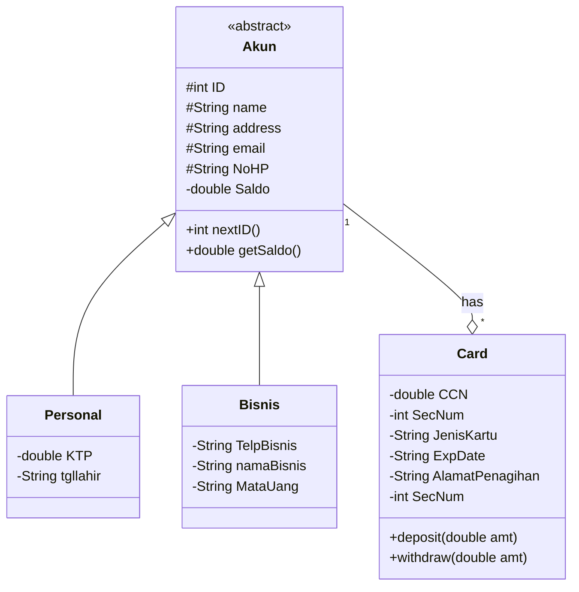
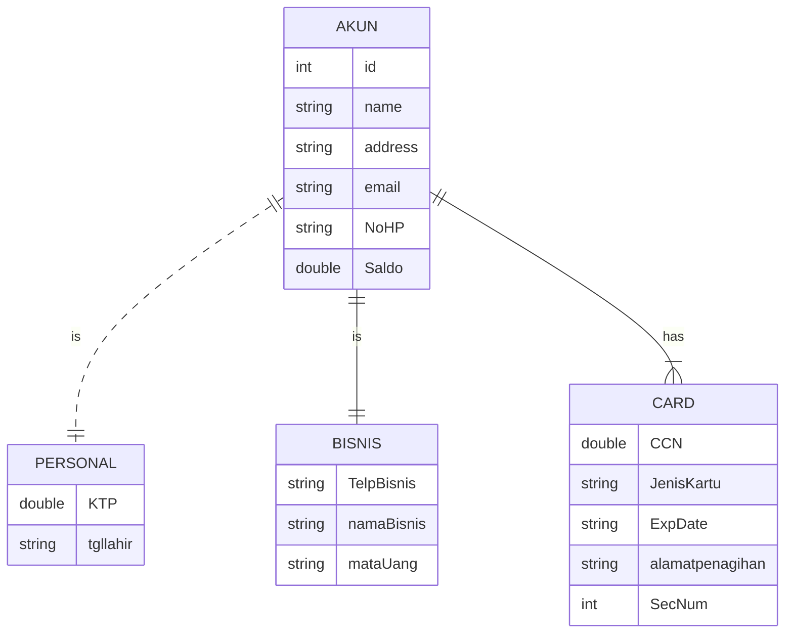

# Paypay_Projek-UAS-PBO
Projek Final untuk memenuhi UAS mata kuliah Pemrograman Berorientasi Objek
Anggota Kelompok:
1. Aprila Dwi Utami      (1917051012)
2. Nur Ayu Octarina      (1917051039)
3. Fanirizki Sofiyana    (1917051050)


# Pay Pay System
>Sistem PayPay
 adalah sistem yang digunakan untuk melakukan transaksi pembayaran. terdapat dua jenis akun yaitu personal dan bisnis. satu akun dapat memiliki satu atau lebih kartu.

## Desain
>Untuk melihat diagram, install plugin mermaid-diagram di https://github.com/Redisrupt/mermaid-diagrams
### Class Diagram

### ER Diagram

### Design Class Diagram for JavaFX and Database
```mermaid
classDiagram
    Akun <|-- Personal
    Akun <|-- Bisnis
    Akun "1"--o"*" Card : has 
    Akun o-- PaypayDataModel : Data Modeling 
    PaypayDataModel <-- PaypayController : Data Control 
    PaypayDataModel --> DBHelper : DB Connection 
    PaypayController <.. PaypayForm : Form Control

    class Akun{
        <<abstract>>
        #IntegerProperty ID
        #StringProperty name
        #StringProeprty address
        #StringProperty email
        #StringProperty NoHP
        -DoubleProperty saldo

        +IntegerProperty nextID()
        +DOubleProperty getSaldo()
    }

    class Personal{
        -DoubleProperty KTP
        -StringProperty tgllahir
    }

    class Bisnis{
        -StringProperty TelpBisnis
        -StringProperty namaBisnis
        -StringProperty mataUang
    }

    class Card{
        -DoubleProperty CCN
        -IntegerProperty SecNum
        -StringProperty JenisKartu
        -StringProperty ExpDate
        -StringProperty AlamatPenagihan
        -IntegerProperty SecNum
        +deposit(double amt)
        +withdraw(double amt)
    }

    class PaypayDataModel{
        Connection conn
        addAkun()
        addCard()
        getPersonal()
        gertBisnis()
        nextID()
        nextCCN()
    }

    class PaypayController{
        Initialize()
        handleButtonAddCard()
        handleButtonAddAkun()
        loadDataPersonal()
        loadDataBisnis()
        loadDataCard()
        handleClearForm()
    }

    class DBHelper{
        getConnection()
        getConnection(STring driver)
        createTable()
    }
